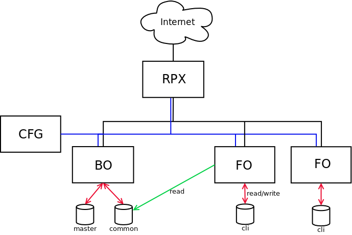

# Ansible playbook for MONARC deployement

This playbook is used to deploy the whole MONARC architecture in accordance to
the figure below.

## Ansible roles

There are three roles, described below.

### monarcco

Common tasks for the front office and the back office.

### monarcbo

[Backoffice](https://github.com/monarc-project/MonarcAppBO).
Only one per environment (dev, preprod, prod...).

### monarcfo

[Frontoffice](https://github.com/monarc-project/MonarcAppFO).
Can be multiple installation per environment to balance to the load.

## Requirements

* Git on all servers;
* Python 2 on all servers. Actually ansible 2.2 features only a tech
  preview of Python 3 support;
* [ansible](https://www.ansible.com/) must be installed on the configuration
  server;
* Postfix on the BO and all FO servers.

## Usage

Install ansible on the configuration server and get the playbook for MONARC:

    $ sudo apt install python-pip
    $ sudo -H pip install ansible dnspython
    $ git clone https://github.com/monarc-project/ansible-ubuntu.git
    $ cd ansible-ubuntu/

If you encounter a problem of locales, try the following:

    $ export LC_ALL="en_US.UTF-8"
    $ sudo dpkg-reconfigure locales

### Configuration

* create a user named *ansible* on each server:
  * ``sudo adduser ansible``
* generate a SSH key for the user *ansible* on the configuration server:
  * ``ssh-keygen -t rsa -C "your_email@example.com"``
* from the configuration server: ``ssh-copy-id ansible@BO/FO/RPX``
* add the user *ansible* in the *sudo* group:
  * ``sudo usermod -aG sudo ansible``
* add the user *www-data* in the *ansible* group:
  * ``sudo usermod -aG  ansible www-data``
* give the permission to ansible to use sudo without password:
  * add ``ansible ALL=(ALL:ALL) NOPASSWD:ALL`` in the file */etc/sudoers* with *visudo*
* create a configuration file, _inventory/hosts_, for Ansible:

        [dev]
        FO

        [dev:vars]
        master= "BO"
        publicHost= "monarc.example.com"

        [master]
        BO monarc_sql_password="password"

        [rpx]
        RPX.localhost

        [monarc:children]
        rpx
        master
        dev

        [monarc:vars]
        env_prefix=""
        clientDomain="monarc.example.com"
        emailFrom="info@example.com"
        github_auth_token="<your-github-auth-token>"
        protocol="https"
        certificate="sslcert.crt"
        certificatekey="sslcert.key"
        certificatechain="sslcert.crt"
        bourlalias="monarcbo"
        localDNS="example.com"

  The variable *monarc\_sql\_password* is the password for the SQL database
  on the BO.

* finally, launch ansible:

        ansible@CFG:~/ansible-ubuntu/playbook$ ansible-playbook -i ../inventory/ monarc.yaml --user ansible

ansible will install and configure the back office, the front office and the
reverse proxy. Consequently the configuration server should be able to contact
these servers through SSH.

### Notes

#### Updating the inventory of ansible

Adding/removing an attribute for the ansible inventory can be done with the
script ``update.sh`` via cron as the user 'ansible'.

    ansible@CFG:~$ crontal -l
    /home/ansible/ansible-ubuntu/playbook/update.sh /home/ansible/ansible-ubuntu/playbook/ $BO_ADDRESS `which ansible-playbook`

The script ``update.sh`` will:

* update the inventory of ansible;
* launch ansible for the creation/suppression of clients;
* synchronize the template of deliveries.

The `add_inventory.py` and `del_inventory.py` scripts are used to dynamically
edit the inventory files of the configuration server. These scripts are used by
``update.sh``.

You can use `list_inventory.py` to check all the current clients in the
inventory of ansible. If want to check the connectivity between the
configuration server and the front office servers:

    ansible@CFG:~$ ./list_inventory.py ../inventory/ | cut -f 1 -d ' ' | uniq | xargs -n 1 ping -w 1

#### TLS certificate

##### Self-signed certificate

Generation of the certificate:

``sudo openssl req -x509 -nodes -days 1000 -newkey rsa:2048 -keyout /etc/sslkeys/monarc.key -out /etc/sslkeys/monarc.crt``

Then provide the address of the certificate (here monarc.crt) and the address
of the certificate key in the configuration file (_inventory/hosts_).
You can generally set _certificatechain_ to the empty string.

##### Let's Encrypt certificate

Generation of the certificate:

``sudo -E letsencrypt certonly --agree-tos -m <your-email> --webroot -d <clientDomain> -w /var/www/letsencrypt/``

Then simply set the value of _certificate_ to _letsencrypt_.   
And set the values of _certificatekey_ and _certificatechain_ to the empty
string.

#### Postfix

Installation of Postfix on the BO and the FO is not done by ansible. You have
to do it manually.

#### Backup

ansible keep an up-to-date database backup script on each FO server instances.
This script is located at ``/usr/local/bin/backup_monarc_db.sh`` and is updated
by ansible on each client creation/deletion.  

You just have to set a cron rule in order to launch the script periodically.

The database backups will be placed in the folder
``/var/lib/mysql-backup/monarc/``

## Issues

For security issues please contact us to
[info@cases.lu](mailto:info@cases.lu?subject=MONARC).

For other issues (ideas, improvements, etc.), you can directly submit
it to [GitHub](https://github.com/monarc-project/MonarcAppFO/issues)
