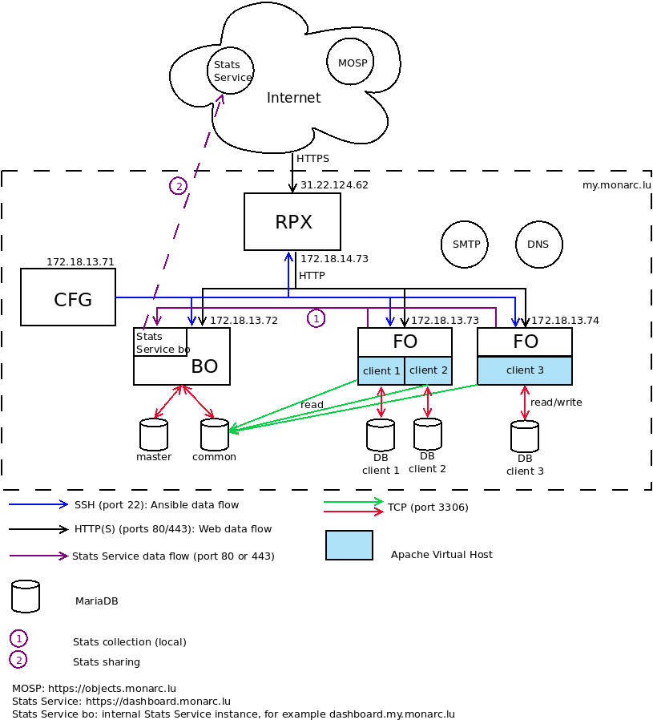

# Ansible playbook for MONARC deployement

This playbook is used to deploy the whole MONARC architecture in accordance to
the figure below.




### Ansible roles

There are three roles, described below.

### monarcco

Common tasks for the front office and the back office.

### monarcbo

[Backoffice](https://github.com/monarc-project/MonarcAppBO).

### monarcfo

[Frontoffice](https://github.com/monarc-project/MonarcAppFO).
Can be multiple installation per client to balance to the load.


## Requirements

* Git and Python 3 on all servers;
* [Ansible](https://www.ansible.com/) must be installed on the configuration
  server;
* Postfix on the BO and all FO servers (for the password recovery feature of
  MONARC).


Python 3 should be the default on the system. For example:

```bash
$ python --version
Python 3.10.0
```


Get the playbook for MONARC and install Ansible on the configuration server:

```bash
$ git clone https://github.com/monarc-project/ansible-ubuntu.git
$ cd ansible-ubuntu/
$ poetry install
$ poetry shell
```

Poetry is not mandatory but convenient to manage the dependencies. Installation
is described [here](https://github.com/python-poetry/poetry#installation=).


## Configuration

### SSH

* create a user named *ansible* on each server:
  * ``sudo adduser ansible``
* generate a SSH key for the user *ansible* on the configuration server:
  * ``ssh-keygen -t rsa -C "your_email@example.com"``
* from the configuration server:
  * ``ssh-copy-id ansible@BO``
  * ``ssh-copy-id ansible@FO``
  * ``ssh-copy-id ansible@RPX``

At that point you must check that it is possible to connect from the
configuration server to the other servers without having to enter a password.

### Unix groups

* add the user *ansible* in the *sudo* group:
  * ``sudo usermod -aG sudo ansible``
* add the user *www-data* in the *ansible* group:
  * ``sudo usermod -aG  ansible www-data``
* give the permission to ansible to use sudo without password:
  * add ``ansible ALL=(ALL:ALL) NOPASSWD:ALL`` in the file */etc/sudoers* with *visudo*


### Ansible

* create a configuration file, _inventory/hosts_, for Ansible:

```ini
[dev]
FO

[dev:vars]
master= "BO"
publicHost= "monarc.example.com"

[master]
BO monarc_sql_password="password"

[rpx]
RPX.localhost

[monarc:children]
rpx
master
dev

[monarc:vars]
env_prefix=""
clientDomain="monarc.example.com"
bourlalias="monarcbo"
emailFrom="info@example.com"

protocol="https"
certificate="sslcert.crt"
certificatekey="sslcert.key"
certificatechain="sslcert.crt"

localDNS="example.com"

terms="https://my.monarc.lu/terms.html"

stats_service="/var/lib/monarc/stats-service"
stats_service_prefix_url="dashboard"

github_auth_token="<your-github-auth-token>"
```

In the section ``[dev]``, ``FO`` should be resolved by the internal DNS. It is
the internal name of the front office server. Same for the other servers. If
you can not change the internal DNS, it is possible to handle this thanks to
the file ``/etc/hosts`` of the system.

The variable *monarc\_sql\_password* is the password for the SQL database
on the BO. Ansible will use it in order to create a new SQL user on the back
office with the corresponding databases.

You can have a look at this real [example file](examples/hosts).


In ```monarcco/defaults/main.yaml``` configure the version of NodeJS. It will
be added in the APT repositories.


Finally, launch Ansible:

```bash
ansible@CFG:~/ansible-ubuntu/playbook$ ansible-playbook -i ../inventory/ monarc.yaml --user ansible
```

Ansible will install and configure the back office, the front office and the
reverse proxy. Consequently the configuration server should be able to contact
these servers through SSH.


## Notes

### Updating the inventory of Ansible

Adding/removing an attribute for the ansible inventory can be done with the
script ``update.sh`` via cron as the user 'ansible'.

```bash
ansible@CFG:~$ crontal -l
/home/ansible/ansible-ubuntu/playbook/update.sh /home/ansible/ansible-ubuntu/playbook/ $BO_ADDRESS `which ansible-playbook`
```

Optionally as a fourth argument you can specify the Python executable (environment) to use.

The script ``update.sh`` will:

* update the inventory of Ansible;
* launch Ansible for the creation/suppression of clients;
* synchronize the template of deliveries.

The `add_inventory.py` and `del_inventory.py` scripts are used to dynamically
edit the inventory files of the configuration server. These scripts are used by
``update.sh``.

You can use `list_inventory.py` to check all the current clients in the
inventory of Ansible. If you want to check the connectivity between the
configuration server and the front office servers:

```bash
ansible@CFG:~$ ./list_inventory.py ../inventory/ | cut -f 1 -d ' ' | uniq | xargs -n 1 ping -w 1
```

### Inventory migrations

If you have an old installation.

#### 1. Add statsToken

This migration adds a Stats Service token (`statsToken`) to the clients without this token.

```bash
ansible@CFG:~/ansible-ubuntu/inventory/migrations$ ./001-add_stats_token_to_inventory.py ../
```


### TLS certificate

#### Self-signed certificate

Generation of the certificate:

```bash
# openssl req -x509 -nodes -days 1000 -newkey rsa:2048 -keyout /etc/sslkeys/monarc.key -out /etc/sslkeys/monarc.crt
```

Then provide the address of the certificate (here monarc.crt) and the address
of the certificate key in the configuration file (_inventory/hosts_).
You can generally set _certificatechain_ to the empty string.

#### Let's Encrypt certificate

Generation of the certificate:

```bash
# certbot certonly --agree-tos -m <your-email> --webroot -d <clientDomain> -w /var/www/letsencrypt/
```

Then simply set the value of _certificate_ to _letsencrypt_.   
And set the values of _certificatekey_ and _certificatechain_ to the empty
string.

### Postfix

Installation of Postfix on the BO and the FO is not done by Ansible. You have
to do it manually.


## Issues

For security issues please contact us to
[info@cases.lu](mailto:info@cases.lu?subject=MONARC).

For other issues (ideas, improvements, etc.), you can directly submit
it to [GitHub](https://github.com/monarc-project/MonarcAppFO/issues)
